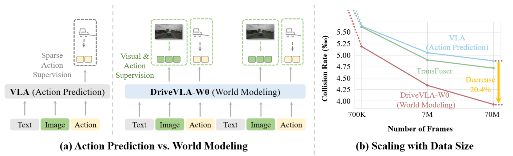

# DriveVLA-W0: World Models Amplify Data Scaling Law in Autonomous Driving
> 📜 [[Arxiv](http://arxiv.org/abs/2510.12796)] 🤗 [[Model Weights](https://huggingface.co/liyingyan/DriveVLA-W0)]

Yingyan Li*, Shuyao Shang*, Weisong Liu*, Bing Zhan*, Haochen Wang*, Yuqi Wang, Yuntao Chen, Xiaoman Wang, Yasong An, Chufeng Tang, Lu Hou, Lue Fan†, Zhaoxiang Zhang†

This paper presents **DriveVLA-W0**, a training paradigm that employs world modeling to predict future images. This generates dense, self-supervised signals, compelling the model to learn the underlying dynamics of the driving environment, addressing the "supervision deficit" in VLA models and amplifying data scaling laws.

<p align="center">
  
</p>

> Due to company policy, only the reviewed part of our codebase is available. Please contact us if you have any questions.

## 📋 Project Structure

```
DriveVLA-W0/
├── assets/                    # Project assets (images, docs, etc.)
├── configs/                   # Model configuration files and normalization stats
│   ├── fast/                 # Fast action tokenizer configs
│   ├── normalizer_navsim_test/    # NAVSIM testset normalization config
│   ├── normalizer_navsim_trainval/ # NAVSIM train/val normalization config
│   └── normalizer_nuplan/    # NuPlan dataset normalization config
├── data/                      # Data pipelines and config
│   ├── navsim/               # NAVSIM-related data
│   └── others/               # Other datasets
├── inference/                 # Inference scripts
│   ├── navsim/               # NAVSIM PDMS evaluation
│   ├── qwen/                 # Qwen model inference
│   └── vla/                  # Emu model inference
├── models/                    # Model definitions
│   ├── policy_head/          # Policy head implementations
│   └── tokenizer/            # Tokenizer implementations
├── scripts/                   # Training and deployment scripts
├── tools/                     # Utility scripts
│   ├── action_tokenizer/     # Action tokenizer tools
│   └── pickle_gen/           # Data preprocessing & pickle generation
├── utils/                     # utils code
│   ├── datasets.py           # Dataset definitions
└── requirements.txt          # Python dependencies
```

## 🚀 Quick Start

### 5-Minute Example

1. **Download Pretrained Models**
```bash
pip install huggingface_hub
export HF_ENDPOINT=https://hf-mirror.com
mkdir pretrained_models
bash scripts/misc/download_emu3_pretrain.sh
```

2. **Set Up Environment**
```bash
conda create -n drivevla python=3.10
conda activate drivevla
pip install -r requirements.txt
```

3. **Download Model Weights**
Download Emu3_Flow_Matching_Action_Expert_PDMS_87.2 and navsim_emu_vla_256_144_test_pre_1s.pkl from [Hugging Face](https://huggingface.co/liyingyan/DriveVLA-W0).

4. **Run Inference**
```bash
# Run inference using pretrained model (update paths as needed)
bash inference/vla/infer_navsim_flow_matching_PDMS_87.2.sh
```

## 📊 Data Preparation

### NAVSIM Dataset

DriveVLA-W0 uses the NAVSIM (v1.1) dataset for training and evaluation. Steps required:

1. **Obtain NAVSIM Dataset**
   - Visit the [official NAVSIM repo](https://github.com/autonomousvision/navsim/tree/v1.1)
   - Download the train and test data splits
   - The data includes sensor information, scenario metadata, and labels

2. **Data Preprocessing**
   ```bash
   # Generate VQ indices
   python tools/pickle_gen/pickle_generation_navsim_pre_1s.py

   # Generate NAVSIM pickle files
   bash scripts/tokenizer/extract_vq_emu3_navsim.sh
   ```

3. **Data Format**
   - Preprocessed data is saved in `data/navsim/processed_data/`
   - Contains scenario files, metadata, and extracted features

### Dataset Size
- **Training**: ~100,000 driving frames
- **Validation**: ~10,000 frames
- **Test**: NAVSIM test set

## 💻 Hardware Requirements

### Training Resource Consumption
8x L20 GPUs (40GB memory each), ~16 hours

# Install

## CUDA Installation

If your system does not already have CUDA 12.4+, please install it first:

```bash
# Download CUDA 12.8.1 (recommended version)
wget https://developer.download.nvidia.com/compute/cuda/12.8.1/local_installers/cuda_12.8.1_570.124.06_linux.run

# Install CUDA toolkit
bash cuda_12.8.1_570.124.06_linux.run --silent --toolkit --toolkitpath=/usr/local/cuda-12.8

# Add to your ~/.bashrc or shell profile
export CUDA_HOME=/usr/local/cuda-12.8
export PATH=$CUDA_HOME/bin:$PATH
export LD_LIBRARY_PATH=$CUDA_HOME/lib64:$LD_LIBRARY_PATH
```

## Conda Environment Setup

```bash
# Create Conda environment
conda create -n drivevla python=3.10
conda activate drivevla

# Install PyTorch (CUDA 12.4)
pip install torch==2.4.0 torchvision==0.19.0 torchaudio==2.4.0 --index-url https://download.pytorch.org/whl/cu124

# Install core dependencies
pip install -r requirements.txt
pip install "transformers[torch]"

# Install training-related dependencies
pip install deepspeed          # Distributed training
pip install scipy              # Scientific computing
pip install tensorboard==2.14.0  # Visualization
pip install wandb              # Experiment tracking
```

### Testing

First, download the model checkpoints from [Hugging Face](https://huggingface.co/liyingyan/DriveVLA-W0).

Then, run the following testing script to produce the output actions (as JSON files):
```
bash inference/vla/infer_navsim_flow_matching_PDMS_87.2.sh
```
Finally, run the script below to compute the PDMS metrics using the generated JSONs (with the conda environment and a valid [navsim repo](https://github.com/autonomousvision/navsim/tree/v1.1)):
```
bash inference/vla/eval_navsim_metric_from_json.sh
```

## ⚙️ Configuration Overview

### Configuration Files

The project uses JSON-formatted configuration files located in `configs/`:

```
configs/
├── moe_fast_video.json          # MoE model fast inference config
├── moe_fast_video_pretrain.json # MoE model pretraining config
├── normalizer_navsim_test/      # NAVSIM test set normalization parameters
├── normalizer_navsim_trainval/  # NAVSIM train+val normalization parameters
└── normalizer_nuplan/           # NuPlan normalization parameters
```

### Normalization Statistics

Normalization parameters are automatically computed from the training datasets:

- `normalizer_navsim_trainval/` — computed on NAVSIM training set
- `normalizer_navsim_test/` — computed on NAVSIM test set
- `normalizer_nuplan/` — computed on NuPlan dataset

# 🏆 NAVSIM v1/v2 Benchmark SOTA

Here is a comparison with state-of-the-art methods on the NAVSIM test set, as presented in the paper. Our model, **DriveVLA-W0**, establishes a new state-of-the-art.

| Method | Reference | Sensors | NC ↑ | DAC ↑ | TTC ↑ | C. ↑ | EP ↑ | PDMS ↑ |
| :--- | :--- | :--- | :--- | :--- | :--- | :--- | :--- | :--- |
| **Human** | | | 100.0 | 100.0 | 100.0 | 99.9 | 87.5 | 94.8 |
| **_BEV-based Methods_** | | | | | | | | |
| LAW | ICLR'25 | 1x Cam | 96.4 | 95.4 | 88.7 | 99.9 | 81.7 | 84.6 |
| Hydra-MDP | arXiv'24 | 3x Cam + L | 98.3 | 96.0 | 94.6 | 100.0 | 78.7 | 86.5 |
| DiffusionDrive | CVPR'25 | 3x Cam + L | 98.2 | 96.2 | 94.7 | 100.0 | 82.2 | 88.1 |
| WoTE | ICCV'25 | 3x Cam + L | 98.5 | 96.8 | 94.4 | 99.9 | 81.9 | 88.3 |
| **_VLA-based Methods_** | | | | | | | | |
| AutoVLA | NeurIPS'25 | 3x Cam | 98.4 | 95.6 | 98.0 | 99.9 | 81.9 | 89.1 |
| ReCogDrive | arXiv'25 | 3x Cam | 98.2 | 97.8 | 95.2 | 99.8 | 83.5 | 89.6 |
| **DriveVLA-W0*** | **Ours** | **1x Cam** | **98.7** | **99.1** | **95.3** | **99.3** | **83.3** | **90.2** |
| AutoVLA† | NeurIPS'25 | 3x Cam | 99.1 | 97.1 | 97.1 | 100.0 | 87.6 | 92.1 |
| **DriveVLA-W0†** | **Ours** | **1x Cam** | **99.3** | **97.4** | **97.0** | **99.9** | **88.3** | **93.0** |

# ⭐ Star 
If you find our work useful for your research, please consider giving this repository a star ⭐.

# 📜 Citation
If you find this work useful for your research, please consider citing our paper:
```
@article{li2025drivevla,
  title={DriveVLA-W0: World Models Amplify Data Scaling Law in Autonomous Driving},
  author={Li, Yingyan and Shang, Shuyao and Liu, Weisong and Zhan, Bing and Wang, Haochen and Wang, Yuqi and Chen, Yuntao and Wang, Xiaoman and An, Yasong and Tang, Chufeng and others},
  journal={arXiv preprint arXiv:2510.12796},
  year={2025}
}
```

# Acknowledgements
We would like to acknowledge the following related works:

[**LAW (ICLR 2025)**](https://github.com/BraveGroup/LAW): Using latent world models for self-supervised feature learning in end-to-end autonomous driving.

[**WoTE (ICCV 2025)**](https://github.com/liyingyanUCAS/WoTE): Using BEV world models for online trajectory evaluation in end-to-end autonomous driving.

[**UniVLA**](https://github.com/baaivision/UniVLA): World modeling in the broader field of robotics.
